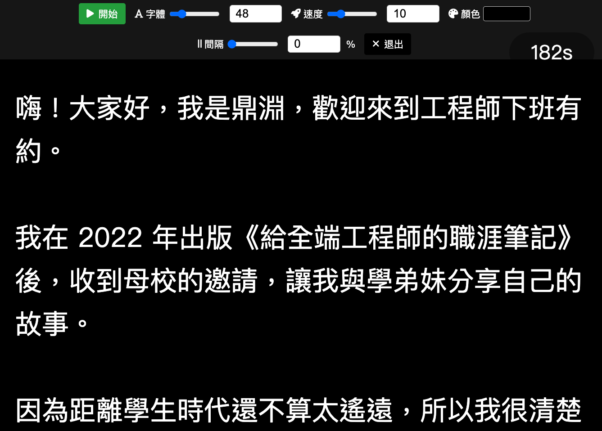
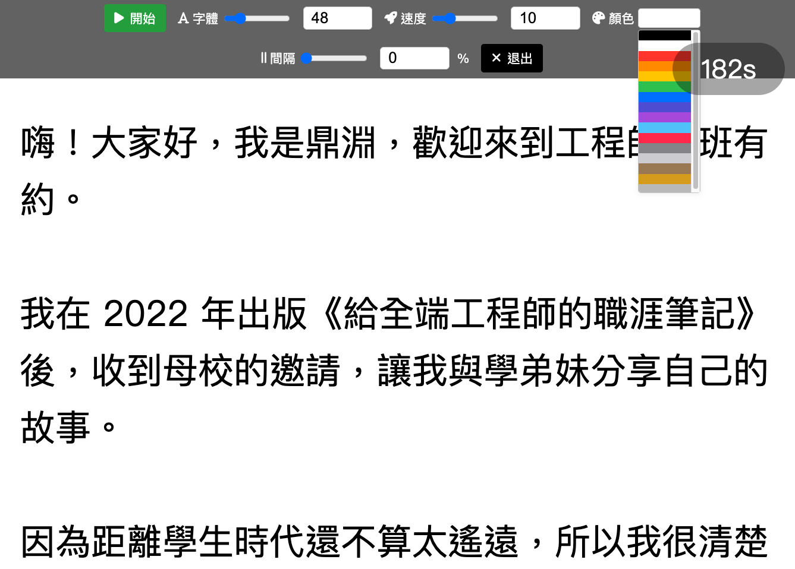

# 讀稿提詞機 • Teleprompter

這是一個簡單易用的網頁版讀稿提詞機，支援中英文切換、字體大小調整、滾動速度調整、背景顏色切換與全螢幕模式，適合錄影、直播、演講等場合使用。

## 功能特色

- 支援中英文介面切換
- 可自訂稿件內容
- 支援「網頁全螢幕」與「瀏覽器全螢幕」兩種模式
- 快捷鍵操作（ESC 退出、Space 開始/暫停）

- 字體大小、滾動速度可調整
- 根據字體大小、速度來預估講稿時間

- 多種背景顏色選擇，文字顏色自動反差
- 響應式設計，手機、平板、桌機皆可用

## 使用方式

1. 開啟 https://deanlin.net/teleprompter/ ，即可直接在瀏覽器中使用（無需安裝）。
2. 貼上你的稿件內容。
3. 選擇語言、字體大小、滾動速度與背景顏色。
4. 點擊「網頁全螢幕」或「畫面全螢幕」進入提詞模式。
5. 使用 Space 鍵開始/暫停滾動，ESC 鍵退出全螢幕。

## 技術

- [Vue 3（CDN 版）](https://vuejs.org/)
- [Font Awesome Icons](https://fontawesome.com/)
- 純前端、無需後端

## 作者

- [林鼎淵 Dean Lin](https://facebook.com/deanlinbao)
- [GitHub](https://github.com/dean9703111)
- [YouTube 頻道](https://youtube.com/@dlcorner)
